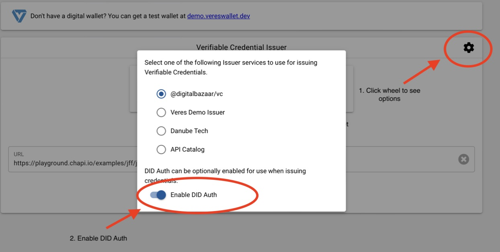
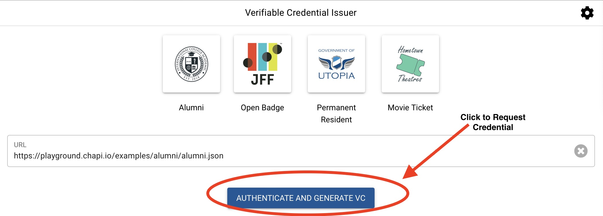

# DCC JFF Plugfest 2 Integration Guide

A quick guide for JFF partners, who would like to integrate with either of the:

[DCC Learner Credential Wallet (LCW)](#learner-credential-wallet)
[DCC Issuer (sign-and-verify)](#sign-and-verify)

Full details about the second round of the Plugfest:

[JFF Interoperability Plugfest 2](https://w3c-ccg.github.io/vc-ed/plugfest-2-2022/)

## sign-and-verify

Wallets wanting to integrate with DCC Issuer (sign-and-verify)

The DCC Issuer will be registered with the chapi.io playground:

[playground.chapi.io](playground.chapi.io)

Simply head to the playground, and:

1. From the options screen, choose DCC as the issuer and also enable DIDAuth:



2. Request your credential.  The playground will guide you through the process of choosing your wallet and importing the credential.



TODO:  WANT TO EXPLAIN WHAT WALLETS NEED TO DO TO INTERACT WITH THE CHAPI.IO PLAYGROUND

TODO: LIKELY HAVE TO ADD new endpoint /credentials/issue TO sign-and-verify, that copies /issue/credentials
but hardcodes the verification method directly into the endpoint so it doesn't have to be passed.

## Learner Credential Wallet

For this round of JFF (second round), the LCW will be invoked with a deep link.

Make sure the end user understands that they must click the link from a web browser on their phone, and that they must already have the LCW installed.

[Install Wallet from here - Apple and Android](https://lcw.app) 

Construct a deeplink as follows and make that deeplink available on a web page (although you could email it too).  

The deep link must start with 'dccrequest://request?' || 'org.dcconsortium://request?'

Include these four request parameters, with the values as specified:

<b><i>auth_type=bearer</i><b>

<b><i>issuer=jff</i></b>

<b><i>challenge</i></b>

The wallet will add this to a Verifiable Presentation that it signs with the holder's DID, so as to foil replay attacks.  It is therefore up to you (the issuer) to pass in a challenge that you can later verify when the VP is submitted to your vc_request_url.  You might also want to use the challenge for other reasons, for example, to identify the specific credential being requested, or to act as a kind of bearer token that confirms that the end user had authenticated in some prior step.  There is, however, also a 'challengeId' path parameter on the vc_request_url (defined below) that you can use to for similar things, like to identify the particular credential instance.

<b><i>vc_request_url</i></b>

This is your endpoint from which the wallet will request the credential.  This is called /exchange/{exchangeId} in the VC-API spec.  So, an example might be: https://myissuer.org/exchange/8989844, but it is of course entirely up to you how your url is named since the wallet simply takes it as-is and invokes it, passing in a DID Auth with the wallet holder’s DID, and with the challenge described below.  Note that the 'exchangeId' can be anything you like, but is intended to identify the specific instance of the credential being requested.

An example of a full deep link:

org.dcconsortium://request?auth_type=bearer&issuer=jff&challenge=90u09jm2fa04&vc_request_url=http://issuer.myserver.org/exchange/8989844

TODO: would be great to make this a working deep link that opens the LCW which then hits the instance of sign-and-verify that we now have running for the JFF Plugfest (Plugfest 1), returning a signed credential.

When invoked with this deeplink, the wallet will send a standard DID Auth VP to’ vc_request_url’ containing:

 - the holder DID to which to issue the credential
 - the 'challenge' that had been orginally passed in on the deep link.

Here is an example (taken from https://w3c-ccg.github.io/vp-request-spec/#example-a-did-authentication-response):

```
{
  "@context": ["https://www.w3.org/2022/credentials/v2"],
  "type": "VerifiablePresentation",
  "holder": "did:example:12345",
  "proof": {
    "type": "DataIntegrityProof",
    "cryptosuite": "eddsa-2022",
    "verificationMethod": "did:example:12345#key-1",
    "challenge": "99612b24-63d9-11ea-b99f-4f66f3e4f81a",
    "domain": "example.com",
    "created": "2022-02-25T14:58:42Z",
    "proofPurpose": "authentication",
    "proofValue": "z3FXQjecWufY46...UAUL5n2Brbx"
  }
}
```

The wallet then expects to receive in return the Verifiable Credential for the holder, with the submitted holder DID includes as the subjectId in the VC.

And that’s it!
