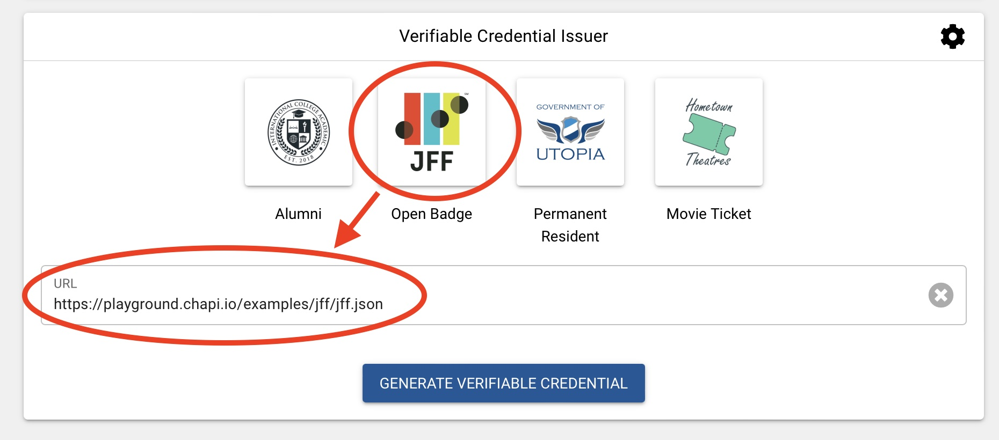
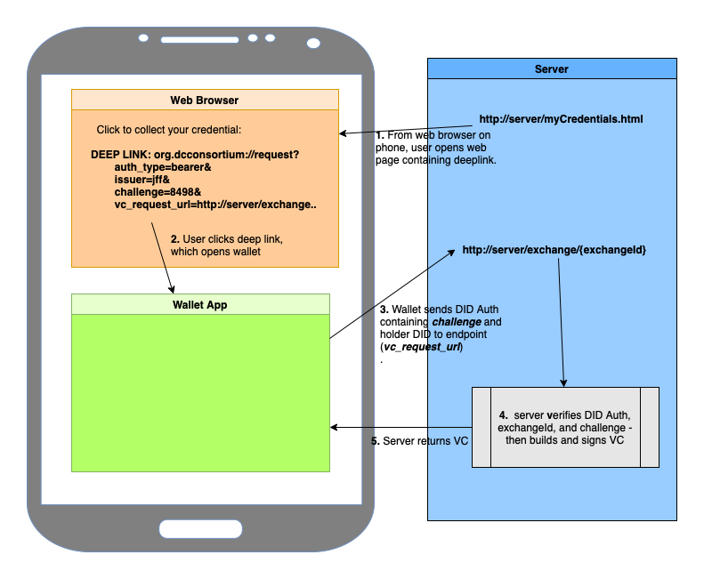

# DCC JFF Plugfest 2 Integration Guide

A quick guide for JFF partners, who would like to integrate with either the [DCC Issuer (sign-and-verify)](https://github.com/digitalcredentials/sign-and-verify) or the [DCC Learner Credential Wallet (LCW)](https://github.com/digitalcredentials/learner-credential-wallet)

## Table of Contents

  * [JFF Plugfest 2 Overview](#jff-plugfest-2-overview)
  * [Integrating with the DCC Issuer (sign-and-verify)](#integrating-with-the-dcc-issuer--sign-and-verify-)
  * [Integrating with the Learner Credential Wallet](#integrating-with-the-learner-credential-wallet)

## JFF Plugfest 2 Overview

More details about the second round of the JFF Plugfest:

[JFF Interoperability Plugfest 2](https://w3c-ccg.github.io/vc-ed/plugfest-2-2022/)

## Integrating with the DCC Issuer (sign-and-verify)

[sign-and-verify](https://github.com/digitalcredentials/sign-and-verify) is a NodeJS server for issuing verifiable credentials, implementing a subset of the [VC-API specificaiton](https://w3c-ccg.github.io/vc-api).

To enable easier integration with JFF partner wallets, the DCC sign-and-verify issuer will be registered with the [chapi.io playground](playground.chapi.io)

To import a DCC signed JFF Open Badge into your wallet, open the [playground](playground.chapi.io), and:

1. From the options screen:

- choose DCC as the issuer (coming soon)
- enable DIDAuth


2. Click the 'JFF' Open Badge button to select it as the credential type.



3. Click 'Authenticate and Generate VC' to request your credential.  The playground will guide you through the process of choosing your wallet and importing the credential.


Coming soon:  link to CHAPI docs that explain how wallets interact with the playground.

## Integrating with the Learner Credential Wallet

For JFF 2, the Learner Credential Wallet (LCW) will be invoked with a deep link like this example:

`org.dcconsortium://request?auth_type=bearer&issuer=jff&challenge=90u09j04&vc_request_url=http://issuer.myserver.org/exchange/8989844`

Make sure the end user understands that they must click the deep link while on their phone, from either a web page or an email, and that they must already have the DCC wallet installed.

[Install the DCC LCW from here - Apple and Android](https://lcw.app) 

### Overall Flow



### Deep Link

The deep link must start with either:

- 'dccrequest://request?'
- 'org.dcconsortium://request?'

and must include these four request parameters, with the values as specified:

- <b><i>auth_type=bearer</i></b>

- <b><i>issuer=jff</i></b>

- <b><i>challenge={your_generated_value}</i></b>

The wallet will add the challenge value to a DID Auth Verifiable Presentation that it signs with the holder's DID, so as to foil replay attacks.  It is therefore up to you (the issuer) to pass in a challenge that you can later verify when the VP is submitted to your vc_request_url.  You might also want to use the challenge for other reasons, for example, to identify the specific credential being requested, or to act as a kind of bearer token that confirms that the end user had authenticated in some prior step.  There is, however, also a 'challengeId' path parameter on the vc_request_url (defined below) that you can use to for similar things, like identifying the particular credential instance.

- <b><i>vc_request_url={your_issuer_url}</i></b>

This is your endpoint from which the wallet will request the credential.  This is called /exchange/{exchangeId} in the VC-API spec.  So, an example might be: https://myissuer.org/exchange/8989844, but it is of course entirely up to you how your url is named since the wallet simply takes it as-is and invokes it, passing in a DID Auth with the wallet holder’s DID, and with the challenge described below.  Note that the 'exchangeId' can be anything you like, but is intended to identify the specific instance of the credential being requested.


When invoked with this deeplink, the wallet will send a standard DID Auth VP to’ vc_request_url’ containing:

 - the holder DID to which to issue the credential
 - the 'challenge' that had been orginally passed in on the deep link.

Here is an example DID Auth (taken from https://w3c-ccg.github.io/vp-request-spec/#example-a-did-authentication-response):

```
{
  "@context": ["https://www.w3.org/2022/credentials/v2"],
  "type": "VerifiablePresentation",
  "holder": "did:example:12345",
  "proof": {
    "type": "DataIntegrityProof",
    "cryptosuite": "eddsa-2022",
    "verificationMethod": "did:example:12345#key-1",
    "challenge": "99612b24-63d9-11ea-b99f-4f66f3e4f81a",
    "domain": "example.com",
    "created": "2022-02-25T14:58:42Z",
    "proofPurpose": "authentication",
    "proofValue": "z3FXQjecWufY46...UAUL5n2Brbx"
  }
}
```

The wallet then expects to receive in return the Verifiable Credential for the holder, with the submitted holder DID included as the subjectId in the returned VC.

And that’s it!
