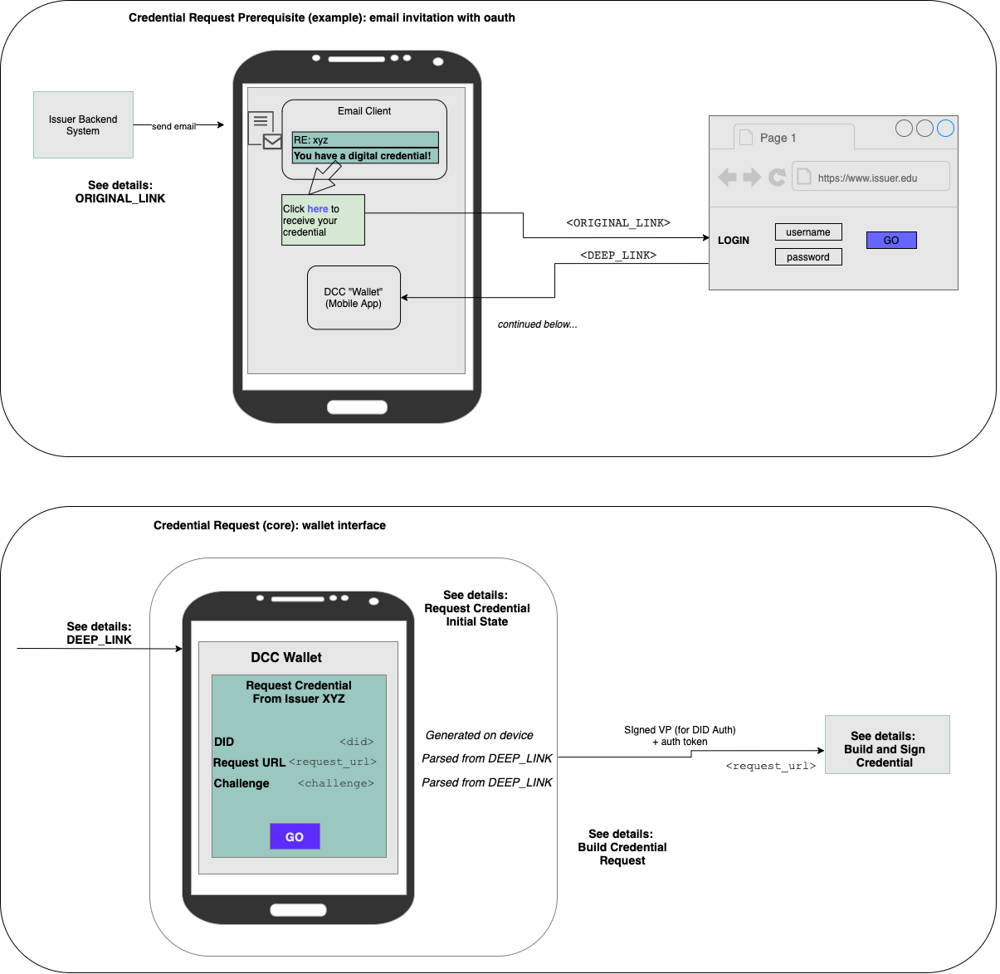

# Credential Request Flow

This is a representative e2e demonstration of how an issuer can integrate DCC credential requests into their systems. This demonstrates initiating the exchange with a link that performs oauth, but this can be adapted to other flows.

The only requirements are those assumed by the DCC client app interface (corresponding to the lower half of the diagram, marked "core"), including"
- DEEP_LINK to open DCC client app to the credential request page
- Server "request credential" endpoint to accept DCC client app's request



## ORIGINAL_LINK

`ORIGINAL_LINK` contains the following information needed by the issuer and the DCC client app:
- Authentication URL
- Credential Request URL
- Deep link (platform-specific)
- Challenge (for the DCC client digital signature)
- Any other state needed by the issuer app

With oauth, the `ORIGINAL_LINK` sent to the user would have the following structure:

```
https://<issuer_authentication_url>/authorize
   ?client_id=<client_id>        // provided by issuer
   &response_type=code
   &state=<state>                // DCC client state; not used for mobile scenarios
   &redirect_uri=<redirect_uri>  // deep link into DCC client with request params (or intermediate service)
   &scope=<scope>                // if needed by issuer
```

`redirect_uri` is either a deep link into the DCC client app or an intermediate service that provides that link. It's described in detail in the next section

## Request Credential Initial State

After successful authentication, the user is redirected (via `redirect_uri` or intermediate service) into the DCC Wallet "Request Credential" screen. 

For the DCC mobile app client, `redirect_url` looks like:

```
dcc:request?                         // mobile app deep link
    request_url=<request_url>        // credential request url, encoded
    &challenge=<challenge>           // challege for signing
```

We'll refer to this as `DEEP_LINK`. 

Details:
- The `request_url` value is required by the DCC client app. That is the issuer's credential request endpoint the DCC client app will hit
    - May include additional parameters that the DCC client app will pass along. This is useful, for example, for specifying additional state needed to lookup the subject's credential to be issued 
    - e.g. [&issuance_id=<issuance_id>...]
- The `challenge` is required by the DCC client app for inclusion in the signed message sent to the request URL

The wallet generates the `did`.

ISSUES (TODO -- update above):
- DEEP_LINK will also need to accept a parameter for a url at which to request an oauth access token, and the wallet app would need to use the access/refresh tokens provided back there to authenticate subsequent request(s)
- Issuer needs to enable PKCE on their end.

## Build Credential Request

Note: Wallet uses `sign-and-verify` library to create and sign the VP in the following steps.

- Wallet creates a Verifiable Presentation with the following information
  - `did`
  - `challenge`
  - `presentation_id` (optional)
- Signs the VP
- On click, sends signed VP to `request_url`

## Build and Sign Credential

This details the final step of the of the Credential Request ceremony. (see "Issuer Credential Request Endpoint" in the diagram above)

This is the flow:
1. Check auth state, as needed
2. Verify the subject's `did`
    - Use `sign-and-verify` library/service
    - Endpoint: `/verify/presentations`
    - Details below
3. If verified, extract (and store) the subject's DID
4. Lookup/construct credential
    - Use session state to lookup which credential we want to issue to the subject, and construct credential
    - Add the subject DID (from step 3) to the credential (`credentialSubject.id`)
5. Sign (issue) the credential 
    - Use `sign-and-verify` library/service
    - Endpoint: `/issue/credentials`
6. Store credential and related accounting information
7. Return the VC

