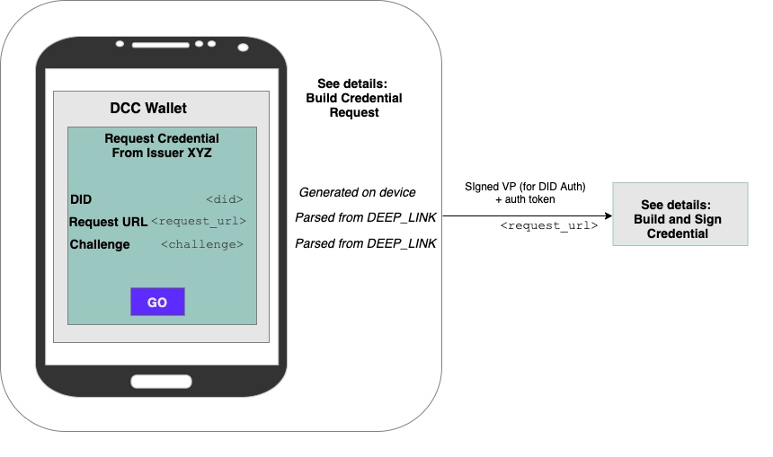

# Credential Request Flow

This is a representative e2e demonstration of how an issuer can integrate DCC credential requests into their systems. This demonstrates initiating the exchange with a link that uses oauth 2.0, but this can be adapted to other flows.

## DEEP_LINK

`DEEP_LINK` contains information needed by the issuer and the DCC client app:

```
dccrequest:request?                  // DCC: mobile app deep link
    authorize_url=<authorize_url>    // oauth authorize url
    &token_url=<token_url>           // oauth token url
    &client_id=<client_id>           // oauth client id: provided by issuer
    &response_type=code              // oauth response type
    &state=<state>                   // oauth state: DCC client state; not used for mobile scenarios
    &scope=<scope>                   // if needed by issuer
    &request_url=<request_url>       // DCC: credential request url
    &challenge=<challenge>           // DCC: challege for signing
    
```

Clicking the link opens the DCC wallet app

## Authenticate with Issuer

The wallet will follow the issuer's authentication instructions provided in DEEP_LINK

Note: Issuer needs to enable PKCE on their end.

## Build Credential Request



After authentication, the user is asked to approve the request of a credential. The following information is used for the request:

- `request_url` (from `DEEP_LINK`) is the issuer's credential request endpoint the DCC client app will hit
    - May include additional parameters that the DCC client app will pass along. This is useful, for example, for specifying additional state needed to lookup the subject's credential to be issued 
    - e.g. [&issuance_id=<issuance_id>...]
- `challenge` (from `DEEP_LINK`) is included  in the signed message sent to the request URL
- `did` is generated by the wallet

Implementation Details:
The wallet uses `sign-and-verify` library to create and sign the VP in the following steps.

- Wallet creates a Verifiable Presentation with the following information
  - `did`
  - `challenge`
  - `presentation_id` (optional)
- Signs the VP
- On click, sends signed VP to `request_url`

[See detailed information about the credential request contract](https://github.com/digitalcredentials/sign-and-verify/blob/master/README.md#requesting-credentials)


## Build and Sign Credential (Performed by Issuer)

This details the final step of the of the Credential Request ceremony. (see "Issuer Credential Request Endpoint" in the diagram above)

This is the flow:
1. Check auth state, as needed
2. Verify the subject's `did`
    - Use `sign-and-verify` library/service
    - Endpoint: `/verify/presentations`
    - [See detailed information](https://github.com/digitalcredentials/sign-and-verify/blob/master/README.md#credential-requests-and-did-verification)
3. If verified, extract (and store) the subject's DID
4. Lookup/construct credential
    - Use session state to lookup which credential we want to issue to the subject, and construct credential
    - Add the subject DID (from step 3) to the credential (`credentialSubject.id`)
5. Sign (issue) the credential 
    - Use `sign-and-verify` library/service
    - Endpoint: `/issue/credentials`
6. Store credential and related accounting information
7. Return the VC

